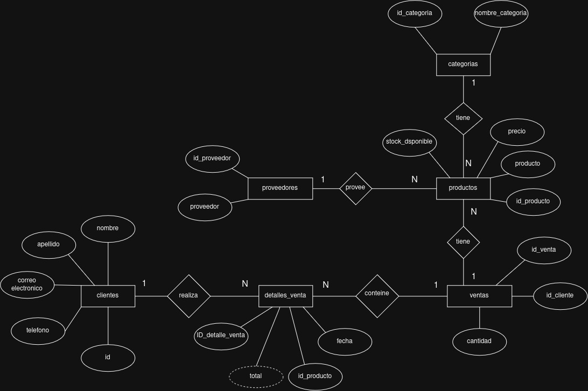

## Tech Zone
Contexto del Problema

La tienda TechZone es un negocio dedicado a la venta de productos tecnológicos, desde laptops y teléfonos hasta accesorios y componentes electrónicos. Con el crecimiento del comercio digital y la alta demanda de dispositivos electrónicos, la empresa ha notado la necesidad de mejorar la gestión de su inventario y ventas. Hasta ahora, han llevado el control de productos y transacciones en hojas de cálculo, lo que ha generado problemas como:

## Explicacion del trabajo realizado.

-   Em este repositorio encontrara la resolucion parcial del examen, las consultas principales, el Diagrama E-R, la estructura de las tablas y la insercion de los datos para cada tabla.

## DIAGRAMA E-R

## FORMA DE EJECUCION
- primero crear la base de datos
- crear la tablas correspondientes
- insertar datos.